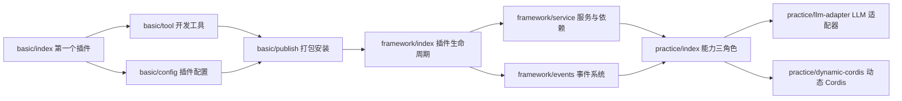

# dsh 插件开发文档（v0.1.5-rc.1）

> 面向 Agent 的利用指南与速查：请查看 `index.agent.md`。

[dsh](https://github.com/deepseek-ai/deepseek-harness) 官方插件开发文档的**中文版**合集索引。

本目录存放 DeepSeek-Harness 官方仓库 `docs/user/develop/` 在版本 **0.1.5-rc.1**（npm 发布包版本号）时期的中文版（`.zh.md`）文档（英文原版见各 `.md`）。内容来源于官方仓库 master 分支，作为本项目开发 dsh 插件时的参考指引。

| 分块 | 作用 |
|:---:|:---|
| [基础](basic/) | 从零写第一个插件：工具、配置、打包安装 |
| [框架](framework/) | Cordis 插件模型：生命周期、事件、服务与依赖 |
| [实战](practice/) | 能力三种角色设计、LLM 适配器与动态 Cordis |

> 说明：本目录仅收录 `docs/user/develop/` 下的中文文档。原文档中指向仓其他路径的链接（如 `README.zh.md`、`cordis-tutorial/`、`subsystems/`、`capability-seams.md`、`cookbook/`、`apps/cli/`、`packages/` 等）不在本次下载范围内，如需参考请前往[官方仓库](https://github.com/deepseek-ai/deepseek-harness)查看原路径。

## 基础（basic）

面向插件开发入门，对应官方文档 `docs/user/develop/basic/`。

| 文档 | 主题 | 前置依赖 |
|:---:|:---|:---:|
| [index.zh.md](basic/index.zh.md) | 第一个插件：创建最小 Harness 插件并加载到 Web UI。插件本质（导出 `apply` 的 TS 模块）、三种形态（函数/对象/类）、自动清理、依赖声明 | 无 |
| [tool.zh.md](basic/tool.zh.md) | 开发一个工具：用 `defineTool` 定义模型可调用工具，含参数校验、输出 schema 与 render | 基础 index |
| [config.zh.md](basic/config.zh.md) | 插件配置：Schemastery schema 声明显式配置与默认值；设计原则（无硬编码可调参数、配置错误要响亮）；配合 HMR | 基础 index |
| [publish.zh.md](basic/publish.zh.md) | 打包与安装：组合包（bundle）与 profile 两种概念、profile 的两种创建入口（`--from-default-profile` 与 `dsh plugin`）、`dsh plugin` 安装、配置层顺序、表层组合包持有命令行、GitHub 安装与构建脚本（`prepare` + `allowBuilds`） | 基础 index、config |

## 框架（framework）

面向 Cordis 插件运行时机制，对应官方文档 `docs/user/develop/framework/`。

| 文档 | 主题 |
|:---:|:---|
| [index.zh.md](framework/index.zh.md) | 插件与生命周期：Fiber 状态机、依赖驱动加载、自动清理机制、嵌套上下文、dispose 语义与 HMR |
| [service.zh.md](framework/service.zh.md) | 服务与依赖：`inject` 声明、Service 基类、类型声明合并、必需/可选依赖、服务消失行为、服务隔离、内置服务 |
| [events.zh.md](framework/events.zh.md) | 事件系统：`ctx.on`/`ctx.emit` 四种模式（emit/bail/serial/waterfall）、类型安全事件、Cordis 事件与会话记录、监听器作为效果 |

## 实战（practice）

面向具体能力的实现，对应官方文档 `docs/user/develop/practice/`。

| 文档 | 主题 | 前置依赖 |
|:---:|:---|:---:|
| [index.zh.md](practice/index.zh.md) | 能力的三种角色设计：Service Definition / Service Provider / Consumer 三角色拆分与组合，以 Bash 为例详解教程；设计要点（不预防性拆分、显式优于隐式） | 基础、framework/service |
| [llm-adapter.zh.md](practice/llm-adapter.zh.md) | LLM 适配器：接入新的模型提供方，继承 `LlmAdapter` 实现 `stream()`，StreamChunk 协议、GenerateOptions、`resolveModel`/`listModels`、错误处理 | practice/index |
| [dynamic-cordis.zh.md](practice/dynamic-cordis.zh.md) | 动态 Cordis：启用 `@deepseek-ai/dsh-tool-cordis` 后，智能体可在内存中挂载/卸载模型编写的插件（临时、随卸载/退出消失） | practice/index |

## 建议阅读顺序

建议从 **basic/index**（第一个插件）进入，沿「基础 → 框架 → 实战」逐篇推进；框架与实战依赖基础部分的示例项目。
